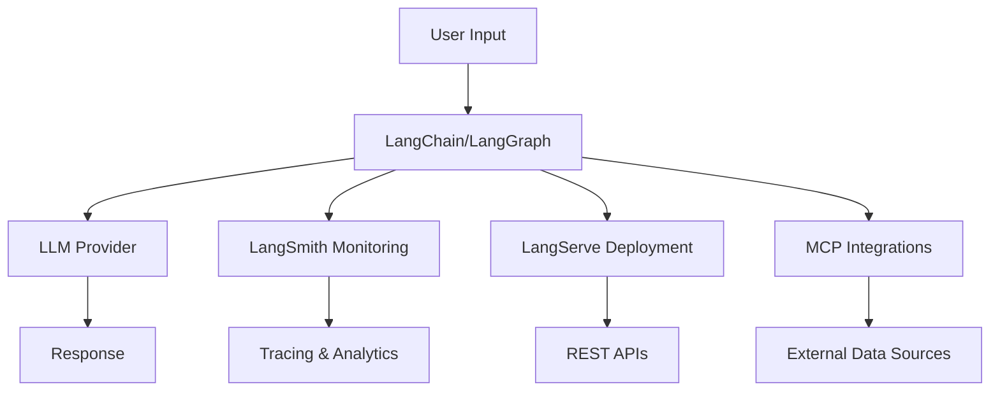

<div align="center">

# 🚀 Welcome to the LangChain Ecosystem

**Your Journey to Building Intelligent AI Applications Starts Here**

[](https://langchain.com)
[](https://langchain.com/langgraph)
[](https://smith.langchain.com)
[](https://langchain.com/langserve)

</div>

---

## 🌟 What is the LangChain Ecosystem?

**LangChain** is a comprehensive framework for developing applications powered by **Large Language Models (LLMs)**. It simplifies every stage of the LLM application lifecycle - from development and testing to production deployment and monitoring.

### 🎯 Core Philosophy

- **🧩 Modular & Composable**: Mix and match components to build exactly what you need
- **🔗 Standard Interfaces**: Consistent APIs across all LLM providers and services
- **🚀 Production-Ready**: Built-in monitoring, evaluation, and deployment tools
- **🔧 Extensible**: Easy integration with external services and custom components

### 💡 What Can You Build?

<table>
<tr>
<td width="50%">

**🤖 Conversational AI**
- Customer support chatbots
- Personal virtual assistants
- Domain-specific Q&A systems
- Multi-turn dialogue systems

**📚 Document Intelligence**
- Knowledge base search (RAG)
- Document summarization
- Research assistance tools
- Legal document analysis

**🔧 Workflow Automation**
- Business process automation
- Data extraction pipelines
- Report generation systems
- Decision support tools

</td>
<td width="50%">

**💻 Code Generation**
- Code completion & debugging
- Technical documentation
- Code explanation & tutorials
- Multi-language translation

**📊 Data Analysis**
- SQL query generation
- Data visualization
- Trend analysis & insights
- Business intelligence

**🤝 Multi-Agent Systems**
- Research teams coordination
- Content creation pipelines
- Quality assurance workflows
- Distributed problem solving

</td>
</tr>
</table>

---

## 🛠️ Ecosystem Components

### 🦜 **LangChain Core**
> *The foundation for building LLM applications*

**Features:**
- 🎯 Chat models & prompt templates
- 🗃️ Vector stores & embeddings
- ⛓️ Chains & runnables
- 🔌 300+ integrations with popular services

**Best For:** Basic LLM applications, simple chains, prototype development

[📖 **Learn LangChain →**](../langchain.md)

---

### 🕸️ **LangGraph** 
> *Framework for stateful, multi-actor applications*

**Features:**
- 🧠 State management & persistence
- 👥 Human-in-the-loop workflows
- 🌊 Real-time streaming support
- 🤖 Advanced agent orchestration

**Best For:** Complex workflows, multi-agent systems, stateful applications

[📖 **Learn LangGraph →**](../langgraph.md)

---

### 🔍 **LangSmith**
> *Platform for monitoring and evaluation*

**Features:**
- 🔍 Request tracing & debugging
- 📊 Performance monitoring & analytics
- 🧪 A/B testing & evaluation
- 📂 Dataset management & versioning

**Best For:** Production monitoring, debugging issues, performance optimization

[📖 **Learn LangSmith →**](../langsmith.md)

---

### 🌐 **LangServe**
> *Deploy LangChain applications as REST APIs*

**Features:**
- ⚡ FastAPI integration
- 📋 Automatic OpenAPI documentation
- 🔌 WebSocket support for streaming
- 🚀 Easy deployment to cloud platforms

**Best For:** API deployment, production serving, scaling applications

[📖 **Learn LangServe →**](../langserve.md)

---

### 🔗 **Model Context Protocol (MCP)**
> *Standardized protocol for connecting AI models to data sources*

**Features:**
- 🌐 Universal connector architecture
- 🔒 Security-first design principles
- 📦 Multi-SDK support (Python, TypeScript, etc.)
- 🔧 Extensible plugin architecture

**Best For:** External integrations, data source connections, tool usage

[📖 **Learn MCP →**](../examples/MCPSection.md)

---

### 🏗️ **Agent Architecture Patterns**
> *Advanced patterns for multi-agent coordination*

**Features:**
- 🤝 Multi-agent coordination
- 📨 Message passing & communication
- 🧠 Shared memory systems
- ⚡ Distributed processing

**Best For:** Complex systems, agent-to-agent communication, enterprise workflows

[📖 **Learn Agent Architecture →**](../examples/AgentArchitectureSection.md)

---

## ⚡ Quick Start Guide

### 1. **Installation & Setup**

<details>
<summary><strong>📦 Core Installation</strong></summary>

```bash
# Install LangChain core
pip install langchain langchain-openai

# Set your API key
export OPENAI_API_KEY='your-api-key-here'
```
</details>

<details>
<summary><strong>🕸️ Agent Framework</strong></summary>

```bash
# Install LangGraph for stateful workflows
pip install langgraph
```
</details>

<details>
<summary><strong>🔍 Monitoring & Evaluation</strong></summary>

```bash
# Install LangSmith for observability
pip install langsmith

# Set your LangSmith API key
export LANGCHAIN_API_KEY='your-langsmith-key'
export LANGCHAIN_TRACING_V2=true
```
</details>

<details>
<summary><strong>🌐 API Deployment</strong></summary>

```bash
# Install LangServe for deployment
pip install langserve[all]
```
</details>

<details>
<summary><strong>🔗 Model Context Protocol</strong></summary>

```bash
# Install MCP for external integrations
pip install mcp
```
</details>

### 2. **Your First LLM Application**

```python
from langchain.chat_models import init_chat_model
from langchain_core.messages import HumanMessage, SystemMessage

# Initialize your chat model
model = init_chat_model(
    model="gpt-4",
    model_provider="openai",
    temperature=0.7
)

# Define system message to set behavior
system_message = SystemMessage(
    content="You are a helpful AI assistant that provides accurate and concise information."
)

# User message
user_message = HumanMessage(content="Explain LangChain in simple terms")

# Get response
response = model.invoke([system_message, user_message])
print(response.content)
```

### 3. **Example: Simple RAG System**

```python
from langchain.document_loaders import TextLoader
from langchain.text_splitter import RecursiveCharacterTextSplitter
from langchain.embeddings import OpenAIEmbeddings
from langchain.vectorstores import FAISS
from langchain.chains import RetrievalQA
from langchain.llms import OpenAI

# 1. Load and process documents
loader = TextLoader("your_document.txt")
documents = loader.load()

# 2. Split into chunks
text_splitter = RecursiveCharacterTextSplitter(
    chunk_size=1000,
    chunk_overlap=200
)
texts = text_splitter.split_documents(documents)

# 3. Create vector store
embeddings = OpenAIEmbeddings()
vectorstore = FAISS.from_documents(texts, embeddings)

# 4. Create QA chain
qa = RetrievalQA.from_chain_type(
    llm=OpenAI(),
    chain_type="stuff",
    retriever=vectorstore.as_retriever()
)

# 5. Ask questions
response = qa.run("What is the main topic of this document?")
print(response)
```

### 4. **Example: MCP Server**

```python
# MCP (Model Context Protocol) Server Example
from mcp import ServerSession
import asyncio
from typing import List, Dict, Any

class DocumentService:
    def __init__(self):
        self.documents = {
            "doc1.txt": {"content": "Document 1 content...", "metadata": {}},
            "doc2.txt": {"content": "Document 2 content...", "metadata": {}}
        }
    
    async def list_documents(self) -> List[str]:
        """List all available documents"""
        return list(self.documents.keys())
    
    async def get_document(self, doc_id: str) -> Dict[str, Any]:
        """Retrieve a specific document by ID"""
        return self.documents.get(doc_id, {"error": "Document not found"})

async def main():
    # Initialize services
    doc_service = DocumentService()
    
    # Create MCP server
    server = ServerSession(
        name="DocumentService",
        version="1.0.0",
        description="Document management service"
    )
    
    # Register resources and their handlers
    @server.resource("documents")
    async def handle_documents() -> List[str]:
        return await doc_service.list_documents()
    
    @server.resource("document/{doc_id}")
    async def get_document(doc_id: str) -> Dict[str, Any]:
        return await doc_service.get_document(doc_id)
    
    # Start the server
    print("Starting MCP server on port 8080...")
    await server.run(port=8080)

if __name__ == "__main__":
    asyncio.run(main())
```

---

## 🛤️ Learning Path

### **Recommended Learning Journey:**

<table>
<tr>
<td align="center" width="16.66%">

**1️⃣**

**LangChain Basics**

Learn prompts, chat models, and simple chains

[🚀 Start Here](../langchain.md)

</td>
<td align="center" width="16.66%">

**2️⃣**

**Build Agents**

Create stateful workflows with LangGraph

[🕸️ Learn More](../langgraph.md)

</td>
<td align="center" width="16.66%">

**3️⃣**

**Add Monitoring**

Implement tracing and evaluation

[🔍 Monitor](../langsmith.md)

</td>
<td align="center" width="16.66%">

**4️⃣**

**Deploy APIs**

Convert chains to production APIs

[🌐 Deploy](../langserve.md)

</td>
<td align="center" width="16.66%">

**5️⃣**

**Integrate External**

Connect to data sources with MCP

[🔗 Integrate](../examples/MCPSection.md)

</td>
<td align="center" width="16.66%">

**6️⃣**

**Scale Systems**

Build multi-agent architectures

[🏗️ Scale](../examples/AgentArchitectureSection.md)

</td>
</tr>
</table>

---

## 🏗️ LangChain Ecosystem Architecture



### **Application Flow:**

1. **🔧 Development**: Build with LangChain components
2. **🕸️ Orchestration**: LangGraph agent workflows  
3. **🔍 Monitoring**: LangSmith observability
4. **🌐 Deployment**: LangServe APIs

### **Integration Layer:**

- **🔗 Model Context Protocol (MCP)**: Universal connector for data sources, APIs, and tools
- **🤝 Agent-to-Agent Communication**: Multi-agent coordination and distributed processing

---

## 🎯 Why Choose the LangChain Ecosystem?

### ✨ **Developer Experience**

- 🎯 **Intuitive APIs**: Consistent interfaces across all components
- 📚 **Comprehensive Docs**: Detailed documentation with real examples
- 🌍 **Active Community**: 50,000+ developers and growing
- 🔄 **Regular Updates**: Monthly releases with new features

### 🚀 **Production Ready**

- 📊 **Built-in Monitoring**: Track performance and debug issues in real-time
- ⚡ **Scalable Deployment**: From prototype to millions of users
- 🔒 **Security First**: Enterprise-grade security and privacy
- 🏆 **Enterprise Reliable**: Trusted by Fortune 500 companies

---

## 🎮 Interactive Examples

### **Try These Popular Patterns:**

1. **[🤖 Customer Support Bot](../examples/agents.md#customer-support-bot)** - Build an intelligent helpdesk
2. **[📚 Document Q&A System](../examples/chains.md#document-qa-system)** - Create a knowledge base
3. **[🔄 Multi-Agent Workflow](../langgraph.md#multi-agent-systems)** - Coordinate multiple AI agents
4. **[🔍 Semantic Search Engine](../examples/indexes.md)** - Find relevant information fast
5. **[🌐 Content Generation API](../langserve.md#content-generation-api)** - Deploy content creation service

---

## 🚀 Next Steps

### **Ready to Start Building?**

<div align="center">

**[📚 Browse Examples →](../examples/)** • **[🎯 Quick Tutorial →](quickstart/)** • **[🔧 Advanced Guides →](../guides/)**

</div>

### **Get Help & Support**

- **💬 Questions?** [GitHub Discussions](https://github.com/langchain-ai/langchain/discussions)
- **🐛 Issues?** [Report Bugs](https://github.com/langchain-ai/langchain/issues)  
- **📖 More Docs?** [Official Documentation](https://python.langchain.com/)

---

<div align="center">

*🌟 **Welcome to the future of AI application development!** 🌟*

**Start building intelligent applications that understand, reason, and act autonomously.**

</div>